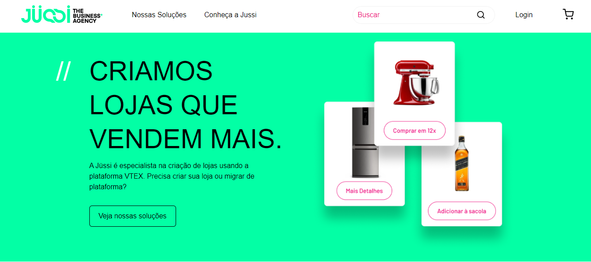
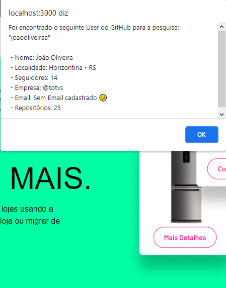

# LandingPage React.

- Projeto desenvolvido para aplicar alguns conhecimentos em react no desafio proposto da empresa [Jüssi](https://jussi.com.br/). 

- Neste projeto foi priorizado aplicar o conceito de componentes para deixar cada parte da landing page independente, e podendo ser reutilizável, tanto como utilizado a contextAPI do próprio REACT com o objetivo de compartilhar informações entre os componentes.

## Funcionalidade

- Landing page desenvolvida através do layout proposto em [Figma](https://www.figma.com/file/O9AEeYB6ZWyMTZzMZhvjaY/loja-vtex-jussi?node-id=0%3A1).

- No campo "Buscar" será possível buscar dados de um usuário do [GitHub] (https://github.com/) para consulta. Esse recurso conta como o uso da API do próprio github para buscar os dados.

- Exemplos de buscas para informar no campo: joaooliveiraa, filipedeschamps, diego3g

## Instalação e execução ​ℹ️ 

- Caso não deseja baixar o projeto, para visualização basta entrar (https://jussi-jussi-home.vercel.app/) ou:

1. Faça um clone desse repositório rodando um `git clone https://github.com/joaooliveiraa/jussi.git`;
2. Entre na pasta rodando `cd jussi`;
3. Rode `yarn` ou `npm install` para instalar as dependências;
4. Rode `yarn start` ou `npm start`;
